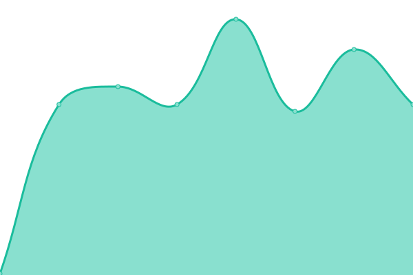
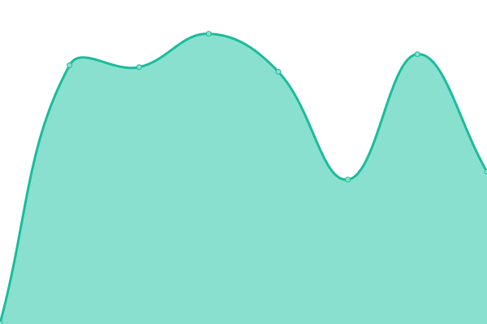
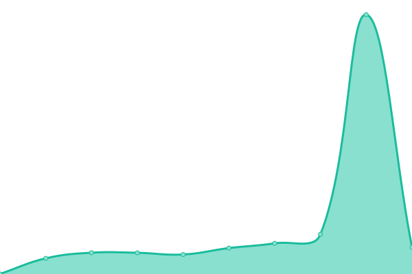
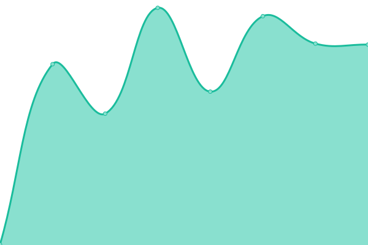

# [📈 Live Status](https://uptime.pokanop.com): <!--live status--> **🟩 All systems operational**

This repository contains the open-source uptime monitor and status page for [Pokanop Apps](https://pokanop.com), powered by [Upptime](https://github.com/upptime/upptime).

With [Upptime](https://upptime.js.org), you can get your own unlimited and free uptime monitor and status page, powered entirely by a GitHub repository. We use [Issues](https://github.com/upptime/upptime/issues) as incident reports, [Actions](https://github.com/upptime/upptime/actions) as uptime monitors, and [Pages](https://upptime.github.io/upptime) for the status page.

<!--start: status pages-->
<!-- This summary is generated by Upptime (https://github.com/upptime/upptime) -->
<!-- Do not edit this manually, your changes will be overwritten -->
<!-- prettier-ignore -->
| URL | Status | History | Response Time | Uptime |
| --- | ------ | ------- | ------------- | ------ |
|  [Pokanop Apps Frontend](https://pokanop.com) | 🟩 Up | [pokanop-apps-frontend.yml](https://github.com/pokanop/uptime/commits/HEAD/history/pokanop-apps-frontend.yml) | 

 222ms
     
 | 

<a href="https://uptime.pokanop.com/history/pokanop-apps-frontend">100.00%</a>
    

|  Pokanop Apps Backend | 🟩 Up | [pokanop-apps-backend.yml](https://github.com/pokanop/uptime/commits/HEAD/history/pokanop-apps-backend.yml) | 

 373ms
     
 | 

<a href="https://uptime.pokanop.com/history/pokanop-apps-backend">100.00%</a>
    

|  [Uptime](https://uptime.pokanop.com) | 🟩 Up | [uptime.yml](https://github.com/pokanop/uptime/commits/HEAD/history/uptime.yml) | 

 123ms
     
 | 

<a href="https://uptime.pokanop.com/history/uptime">100.00%</a>
    

|  Jenkins | 🟩 Up | [jenkins.yml](https://github.com/pokanop/uptime/commits/HEAD/history/jenkins.yml) | 

 340ms
     
 | 

<a href="https://uptime.pokanop.com/history/jenkins">100.00%</a>
    

|  Bitbucket | 🟩 Up | [bitbucket.yml](https://github.com/pokanop/uptime/commits/HEAD/history/bitbucket.yml) | 

 543ms
     
 | 

<a href="https://uptime.pokanop.com/history/bitbucket">100.00%</a>
    

|  Confluence | 🟩 Up | [confluence.yml](https://github.com/pokanop/uptime/commits/HEAD/history/confluence.yml) | 

 585ms
     
 | 

<a href="https://uptime.pokanop.com/history/confluence">100.00%</a>
    

|  Jira | 🟩 Up | [jira.yml](https://github.com/pokanop/uptime/commits/HEAD/history/jira.yml) | 

 507ms
     
 | 

<a href="https://uptime.pokanop.com/history/jira">100.00%</a>
    

|  Docker Registry | 🟩 Up | [docker-registry.yml](https://github.com/pokanop/uptime/commits/HEAD/history/docker-registry.yml) | 

 407ms
     
 | 

<a href="https://uptime.pokanop.com/history/docker-registry">100.00%</a>
    

|  Sourcegraph | 🟩 Up | [sourcegraph.yml](https://github.com/pokanop/uptime/commits/HEAD/history/sourcegraph.yml) | 

 421ms
     
 | 

<a href="https://uptime.pokanop.com/history/sourcegraph">100.00%</a>
    

<!--end: status pages-->

[**Visit our status website →**](https://uptime.pokanop.com)

## 📄 License

- Powered by: [Upptime](https://github.com/upptime/upptime)
- Code: [MIT](./LICENSE) © [Upptime](https://upptime.js.org)
- Data in the `./history` directory: [Open Database License](https://opendatacommons.org/licenses/odbl/1-0/)
